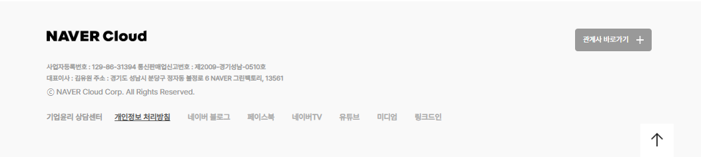

# NaverCloud 메인페이지 제작
HTML, CSS, JavaScript를 이용하여 반응형 웹페이지를 제작하였습니다.

총 4개의 메인 section과 header, footer로 구성되어 있습니다.

## ⭐ 페이지 소개
### 1. header & section_1

  
  

- 슬라이드는 5초마다 자동으로 전환됩니다.
- 스크롤을 내리면 header의 색상이 변경됩니다.
- 각 버튼은 hover효과가 적용되어 있습니다.

### 2. section_2

  
  

- 화면이 767px 미만일 때 반응형 레이아웃이 적용됩니다.

### 3. section_3

  
  

- 오른쪽 카드는 아래에서 위로 이동하는 애니메이션을 적용하였습니다.

### 4. section_4

  
  
  

- 1024px, 767px 미만일 때 반응형 레이아웃이 적용됩니다.

### 4. footer

  
  

- 767px 미만일 때 반응형 레이아웃이 적용됩니다.